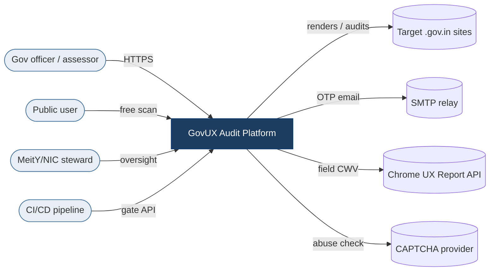
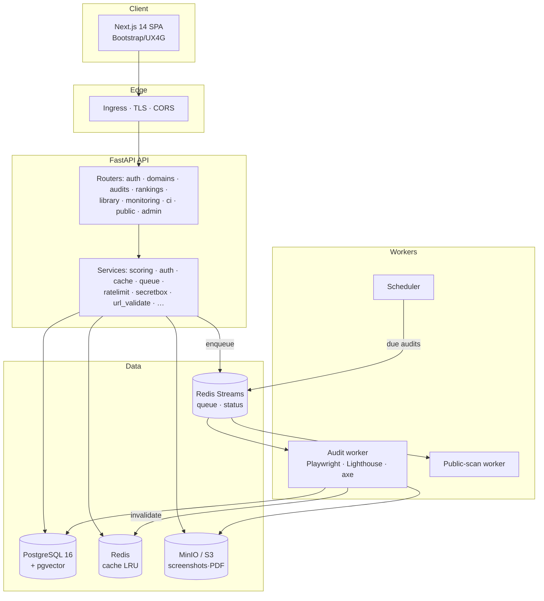
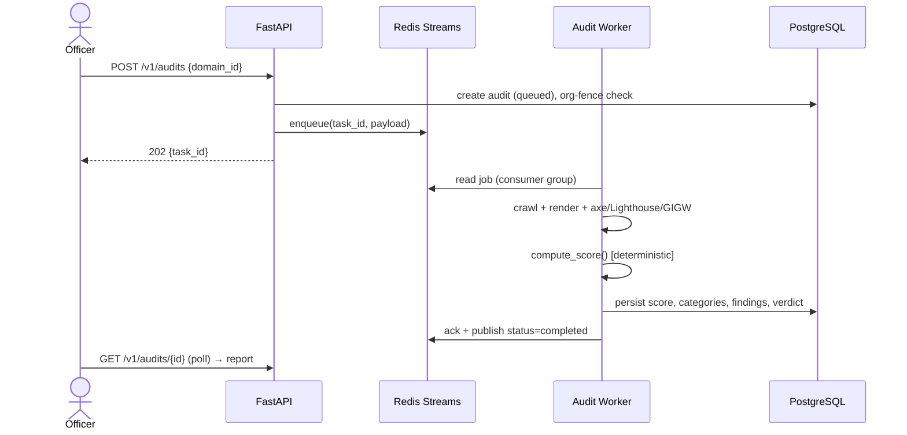

# High-Level Design (HLD)

GovUX Audit Platform — a self-service UX, accessibility & compliance audit
platform for Indian government (`.gov.in`/`.nic.in`) websites, producing a
deterministic 0–100 **GovUX Score** across GIGW 3.0, WCAG 2.2 AA, UX4G, and Core
Web Vitals.

**Companion documents:** [LLD.md](LLD.md) (detailed design) ·
[SECURITY_ARCHITECTURE.md](SECURITY_ARCHITECTURE.md) ·
[ARCHITECTURE.md](../platform/docs/ARCHITECTURE.md) (engineering notes) ·
[DEPLOYMENT.md](DEPLOYMENT.md).

---

## 1. Purpose & scope

| | |
|---|---|
| **Problem** | Government sites vary widely in accessibility, usability, and compliance; assessment is manual, slow, and inconsistent. |
| **Solution** | An automated, deterministic engine that renders each site in real browsers, checks it against codified standards, and produces a comparable score, a compliance verdict, and prioritised fixes. |
| **In scope** | Public free scan; authenticated multi-page audits; expert certification; national/ministry/state oversight; scheduling; CI/CD gate. |
| **Out of scope** | Remediating the audited sites; hosting them; anything non-`.gov.in`/`.nic.in`. |

## 2. Architectural principles (non-negotiable)

1. **Deterministic score** — the score path is pure and LLM/ML-free; the same evidence always yields the same score. ML/CV is *advisory only*, computed **after** the score is committed.
2. **Compliance ≠ UX band** — the legal verdict is computed separately; automated-only evidence can never exceed `partially_compliant`.
3. **Everything heavy is async** — `POST /audits` returns `202 + task_id`; work runs on Redis-Streams workers, never inline.
4. **Government-only** — access is restricted to `*.gov.in`/`*.nic.in` in code **and** a database CHECK constraint.
5. **Evidence integrity** — an uncaptured site yields `insufficient_evidence`, never a guessed score.

## 3. System context

## 4. Architecture overview

Layered, container-per-role. Synchronous auth/transactional writes hit Postgres
(source of truth); heavy audit work is queued to workers.

## 5. Component responsibilities

| Component | Responsibility |
|---|---|
| **Frontend (Next.js)** | Officer/steward UI, public scanner, live audit status, reports; no business logic — calls the API |
| **API (FastAPI)** | AuthN/Z, org-fencing, validation, synchronous writes, read aggregates (cached), enqueue audits |
| **Audit worker** | Consume jobs; crawl+render in Chromium/Firefox/WebKit; run axe/Lighthouse/GIGW rules; map to the deterministic scorer; persist findings; invalidate caches; fire webhooks |
| **Public-scan worker** | Single-concurrency free-scan pipeline (abuse-controlled) |
| **Scheduler** | Poll for due scheduled audits and enqueue them |
| **PostgreSQL (+pgvector)** | System of record: orgs, users, domains, audits, findings, logs |
| **Redis Streams** | Durable job queue + live status; consumer groups, DLQ, crash reclaim |
| **Redis (cache)** | Read-heavy aggregate cache (national/rankings/ministries/states) |
| **MinIO / S3** | Screenshots, generated PDFs, report artifacts |

## 6. Technology stack

| Layer | Technology |
|---|---|
| Frontend | Next.js 14 (App Router), React 18, TypeScript, Bootstrap 5 / UX4G |
| API | FastAPI, Pydantic v2, SQLAlchemy 2.0, Gunicorn/Uvicorn (Python 3.12) |
| Engine | Node.js · Playwright (Chromium/Firefox/WebKit) · Lighthouse · axe-core |
| Data | PostgreSQL 16 + pgvector · Redis 7 (Streams + cache) · MinIO/S3 |
| Advisory ML | scikit-learn (IsolationForest) · XGBoost · Pillow/NumPy (CV) — *out of score path* |
| Ops | Docker Compose · Helm/Kubernetes · Terraform · Ansible · GitHub Actions CI |

Full manifest & versions: [DEPENDENCIES.md](DEPENDENCIES.md).

## 7. Primary data flow — an audit

If the home page can't be captured, the worker records
`insufficient_evidence` (no score). See [LLD.md](LLD.md) for the full state machine.

## 8. Deployment topology

- **Dev:** single-host Docker Compose (all services).
- **Production (single host):** `docker-compose.prod.yml` — Gunicorn multi-worker, split **durable (AOF)** vs **cache (LRU)** Redis, healthchecks, migrate-on-boot.
- **Enterprise / national scale:** Kubernetes via Helm — horizontally scaled API + workers (HPA), managed Postgres/Redis/S3, ingress TLS. Provision with Terraform; configure VM fleets with Ansible.
- **Air-gapped:** offline bundle with pinned images + checksums.

See [DEPLOYMENT.md](DEPLOYMENT.md) and [INSTALL.md](../INSTALL.md).

## 9. External integration points

| Integration | Direction | Required | Notes |
|---|---|---|---|
| Target gov websites | outbound | yes | SSRF-guarded rendering |
| SMTP relay | outbound | login | OTP delivery |
| Chrome UX Report | outbound | optional | field CWV; else lab-only |
| CAPTCHA provider | outbound | optional | public-scanner abuse control |
| CI/CD webhook | outbound | optional | per-audit score push |
| Container registry | install | yes | bundled for air-gap |

## 10. Non-functional requirements

| NFR | Approach |
|---|---|
| **Scalability** | Stateless API + horizontally scaled workers behind a shared stream queue; cached read aggregates; pagination |
| **Availability** | Healthchecks, worker crash-reclaim + DLQ, fail-open cache/limiter (auth lock-out is fail-closed) |
| **Security** | OTP + device-bound tokens, org-fencing, SSRF guard, secrets encrypted at rest, prod secret assertion — see [SECURITY_ARCHITECTURE.md](SECURITY_ARCHITECTURE.md) |
| **Data integrity** | Postgres as source of truth; deterministic score locked by tests; idempotent submit; migrations in sync |
| **Observability** | `/healthz`, `/metrics`, structured logs, request IDs, audit log |
| **Maintainability** | Layered modules, ~90% backend test coverage, contract snapshot, 10-job CI |
| **Portability** | Fully containerised; S3-compatible storage; managed or self-hosted data stores |

## 11. Key architectural decisions

| Decision | Rationale |
|---|---|
| Redis **Streams** (not Celery) | One language-agnostic queue for Python + Node workers; native consumer groups, DLQ, reclaim |
| **Deterministic** score, ML advisory-only | Government defensibility — scores must be reproducible and explainable |
| Compliance verdict **separate** from UX band | Legal accuracy — automation can screen, not certify |
| **Real-browser** engine (Playwright tri-engine) | Cross-browser truth; catches what static analysis can't |
| Gov-only enforced in **code + DB CHECK** | Defence in depth on the core access rule |
| `insufficient_evidence` state | Never fabricate a score from a blocked/uncaptured site |
