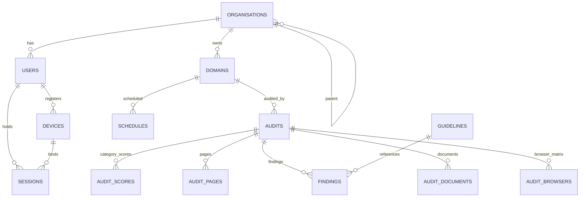
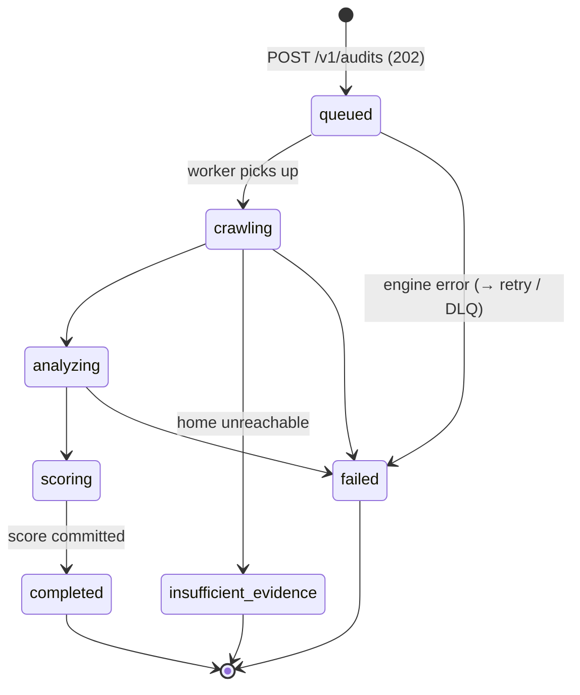
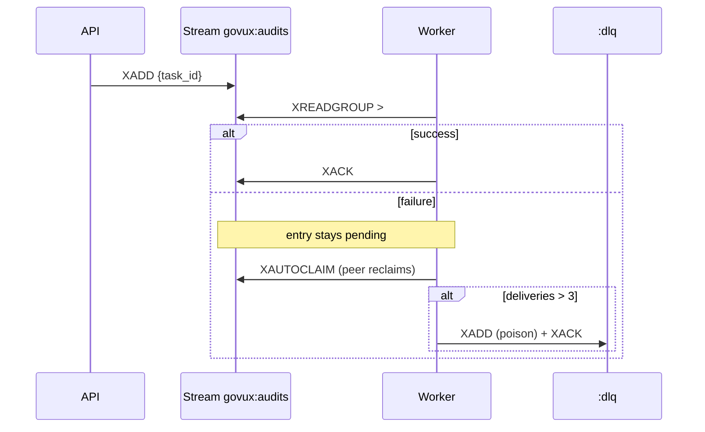

# Low-Level Design (LLD)

Detailed design of the GovUX Audit Platform: module decomposition, data model,
auth, the audit lifecycle, the scoring algorithm, and the queue/worker internals.
Reads on top of the [HLD](HLD.md).

---

## 1. Module decomposition

Three layers. Routers own HTTP + authorisation; services own logic; models own
persistence. No business logic in routers or the frontend.

```
app/
├── main.py            app wiring, CORS, request-id middleware, global exception handler, /healthz /metrics
├── config.py          typed settings (env, prefix GOVUX_)
├── deps.py            current_user, get_db (DI)
├── models.py          SQLAlchemy ORM (20 tables) — mirrors db/schema.sql
├── schemas.py         Pydantic request/response contracts
├── routers/           auth · domains · audits · rankings · library · monitoring · ci · public · scan_requests · admin_config
├── services/          scoring · queue · cache · authguard · secretbox · url_validate · ratelimit · captcha ·
│                      verification · scheduler · remediation · ml_anomaly · ml_priority · design_cv · crux ·
│                      dpdp · discovery · report_pdf · pdf_audit · email · metrics · settings_store · storage · language
├── worker.py          audit job consumer (orchestrates the engine + scoring)
├── public_worker.py   free-scan consumer (single concurrency)
└── audit_engine/      Node: runner.js (Playwright/Lighthouse/axe), gigw-rules.js, compat.js
```

**Key service responsibilities**

| Service | Responsibility | Notable property |
|---|---|---|
| `scoring` | weighted score, bands, guard-rail, compliance verdict | pure, deterministic, LLM-free |
| `queue` | Redis-Streams enqueue/read/ack, DLQ, crash reclaim | at-least-once |
| `cache` | aggregate read cache + prefix invalidation | fail-open |
| `authguard` | escalating sign-in lock-out | **fail-closed** |
| `ratelimit` | fixed-window IP limits (OTP, scans) | fail-open |
| `secretbox` | encrypt SMTP/CAPTCHA secrets at rest | prod key assertion |
| `url_validate` | pre-scan validation + SSRF guard | rejects private ranges |
| `verification` | DNS-TXT domain-ownership proof | |
| `ml_anomaly`/`ml_priority`/`design_cv` | advisory ML/CV | **after** score commit |

## 2. Data model

20 tables in PostgreSQL 16 (+pgvector). Core entities and relationships:



Supporting tables: `otp_codes`, `public_scans`, `scan_requests`, `audit_log`,
`app_settings`, `discovered_domains`, `ranking_publications`.

### Core table specs (selected)

**`users`** — `id`, `email` (unique, `CHECK email ~* '[@.](gov|nic)\.in$'`),
`org_id→organisations`, `role` (`owner|contributor|assessor|programme_admin|super_admin`),
`is_active`, `last_login_at`.

**`domains`** — `id`, `org_id`, `url` (unique, `CHECK url ~* '(\.gov\.in|\.nic\.in)$'`),
`tld`, `service_category`, `size_class`, `verify_method` (`dns_txt|file_upload|sso_mapping`),
`verify_status` (`pending|verified|failed`), `verify_token`.

**`audits`** — `id` (= `task_id`), `domain_id`, `status` (see §4), `scope` (JSONB),
`engine_version`, `pages_total/done`, `overall_score` NUMERIC(5,2), `band` (A–E),
`guardrail_active`, `compliance_status`, `method`, `confidence`, `field_data`
(CrUX JSONB), `anomaly_score` (advisory), `created/started/finished_at`.

**`audit_scores`** — PK(`audit_id`,`category`), `weight` NUMERIC(4,1), `score` NUMERIC(5,2).

**`findings`** — `id`, `audit_id`, `page_id?`, `category`, `severity`
(`critical|high|medium|low`), `guideline_id→guidelines`, `state`
(`open|in_progress|resolved|not_applicable`), `is_reviewed`, `title`.

**`sessions`** — device-bound rotating refresh tokens: `refresh_token_hash`,
`family_id` (reuse-detection family), `device_id`, `expires_at`, `revoked_at`.

Schema is kept in lockstep across `db/schema.sql` ⇄ `app/models.py` ⇄ Alembic
migrations (enforced by the migrations CI job).

## 3. Authentication & session design

Passwordless: email OTP bootstraps a **device-bound, rotating** refresh token
plus a short-lived access JWT.

```mermaid
sequenceDiagram
  actor U as Officer (browser)
  participant API
  participant DB
  U->>API: POST /v1/auth/otp/request {gov email}
  API->>API: gov-email regex + IP rate-limit + brute-force guard
  API->>DB: store OTP hash (5-min TTL)
  API-->>U: OTP emailed (dev: logged)
  U->>API: POST /v1/auth/otp/verify {email, code, device_pubkey}
  API->>DB: verify hash, attempts; create Device + Session(family)
  API-->>U: access JWT (15m) + refresh cookie (device-bound, 60d)
  U->>API: POST /v1/auth/refresh (cookie)
  API->>DB: validate + ROTATE refresh (same family); reuse ⇒ revoke family
  API-->>U: new access JWT
```

- **Access token:** HS256 JWT, 15-min TTL, carries `user_id`, `role`, `device_id`.
- **Refresh:** hashed, rotated on every use; a replayed (reused) token revokes the
  whole `family_id` (theft detection).
- **Brute force:** `authguard` escalates lock-out (10→20 min + CAPTCHA) — fail-closed.
- **Authorisation:** `deps.current_user`; every audit query is **org-fenced**
  (cross-org ⇒ 404, never 403, so existence isn't confirmed).

## 4. Audit lifecycle (state machine)

`audit_status` enum drives the UI and the poll loop.



Terminal states: `completed`, `failed`, `insufficient_evidence`, `cancelled`
(the frontend stops polling on these). `insufficient_evidence` is set when the
engine reports `home_reachable=false` — **no score is written**.

## 5. Scoring algorithm (`services/scoring.py`)

Deterministic, pure, LLM/ML-free. Given eight category scores (0–100):

```
overall = Σ (categoryScore × weight) / 100        # weights sum to 100
```

| Category | Weight | | Category | Weight |
|---|--:|---|---|--:|
| Accessibility | 22 | | Performance/CWV | 12 |
| Usability & UX | 17 | | Design / UX4G | 11 |
| GIGW 3.0 | 15 | | Responsiveness | 10 |
| | | | Content | 7 |
| | | | Trust & security | 6 |

**Bands:** A ≥ 90 · B ≥ 75 · C ≥ 60 · D ≥ 40 · E < 40.

**Guard-rail:** if accessibility < 50 **or** trust < 50, the band is **capped at
C** regardless of the weighted total (`guardrail_active = true`). A high average
can't mask a critical accessibility/trust failure.

**Compliance verdict** (separate from the band, `compliance_verdict()`):
- any **critical accessibility** finding, or accessibility < 50 ⇒ `non_compliant`
- otherwise, automated-only evidence ⇒ **max** `partially_compliant`
- `compliant` is reachable **only** after human certification (`reviewed=true`).

Invariants (weights=100, monotonicity, guard-rail, compliance ceiling) are locked
by `tests/test_scoring_validation.py`. Advisory ML (`ml_anomaly`) runs **after**
the score is committed and can only *annotate*, never change the number.

## 6. Queue & worker internals (`services/queue.py`, `worker.py`)

Redis Streams, one queue for Python + Node workers.

- **Enqueue:** `XADD govux:audits {task_id, payload}`.
- **Consume:** `XREADGROUP` on group `workers`, one consumer per replica (`HOSTNAME`).
- **Ack contract:** `worker._handle` acks **only on success**; a failure leaves the
  entry pending for reclaim/DLQ → at-least-once delivery.
- **Crash recovery:** `reclaim_stale()` uses `XAUTOCLAIM` to reclaim entries idle
  past `min_idle_ms` from dead consumers.
- **Poison messages:** delivered > `MAX_DELIVERIES` (3) → routed to
  `govux:audits:dlq` and acked (stops cycling).
- **Live status:** `HSET govux:status:{task_id}` + `PUBLISH` for polling/WebSocket.
- **Idempotency:** submit is idempotent per in-flight domain; workers persist within
  a transaction so a redelivery re-derives the same deterministic result.



## 7. API surface (grouped)

All under `/v1`. Full contract is frozen by `tests/test_openapi_contract.py`;
live docs at `/docs`.

| Group | Representative endpoints |
|---|---|
| Auth | `POST /auth/otp/request`·`/verify` · `POST /auth/refresh` · `GET/DELETE /auth/devices` |
| Domains | `GET/POST /domains` · `POST /domains/{id}/verify` · `GET /domains/{id}/audits`·`/compare` |
| Audits | `POST /audits` (202) · `GET /audits` · `GET /audits/{id}`·`/report`·`/remediation`·`/documents`·`/trend` · `POST /audits/{id}/review` · `POST /bulk-scans` |
| Oversight | `GET /national`·`/rankings`·`/ministries`·`/states` |
| Public | free-scan submit/status · `GET /guidelines` |
| Ops/Admin | `GET /healthz`·`/metrics` · `GET/PATCH /admin/config` · `GET /ci/gate` |

## 8. Error handling & status codes

- Global exception handler in `main.py` → safe JSON (no stack traces to clients);
  a **request id** is attached to every response and log line.
- Conventions: `202` async accept · `400/422` validation · `401` auth ·
  `404` not-found **and** cross-org (never 403) · `409` not-ready (e.g. report
  before completion) · `429` rate-limited.
- Frontend surfaces inline messages, distinguishes terminal states, and never
  shows a fabricated score for `insufficient_evidence`.

## 9. Caching & invalidation (`services/cache.py`)

- Read-heavy aggregates (`national`, `rankings`, `ministries`, `states`) cached in
  the LRU Redis with a TTL.
- On audit completion the worker calls `invalidate_prefix()` for each aggregate so
  leaderboards can't serve stale numbers.
- Fail-open: a cache miss/error falls back to Postgres (the source of truth).

---

**See also:** [HLD.md](HLD.md) · [SECURITY_ARCHITECTURE.md](SECURITY_ARCHITECTURE.md) ·
[CONFIGURATION.md](CONFIGURATION.md) · [platform/docs/API.md](../platform/docs/API.md) ·
[platform/docs/SCORING_VALIDATION.md](../platform/docs/SCORING_VALIDATION.md).
